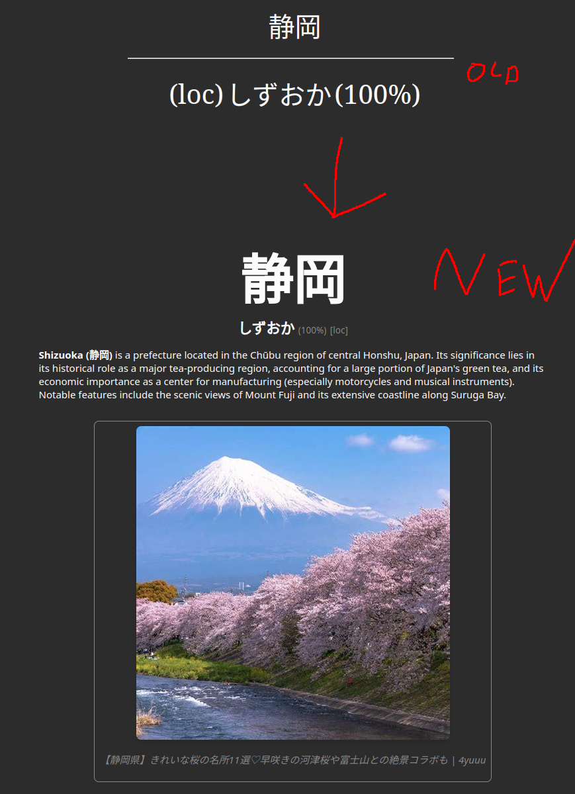

# Japanese Proper Nouns Deck MkII

A huge update on the [existing Japanese Proper Nouns Deck](https://ankiweb.net/shared/info/3885156604). The following things were changed:

1. All cards now have pronunciations. Human pronunciations are used when available, otherwise TTS is used.
2. All cards now have images. Images are sourced from DuckDuckGo and provided together with captions.
3. All cards now have LLM generated descriptions that add context to the cards. (Beware that errors/hallucinations may occur.)

As well as minor layout and formatting changes.

## Support

Want to get audio on all of your Yomitan cards? Check out: [Yomitan Ultimate Audio](https://github.com/friedrich-de/yomitan-ultimate-audio).

Want to support me for future projects? Check out my [Patreon](https://www.patreon.com/Quizmaster).

## Installation

Download the deck from the releases section and import it into Anki.

## Why not on AnkiWeb?

AnkiWeb has a strict upload limit. This deck is too large to be uploaded there.
Additionally the updating process is annoying. This deck is built programatically.